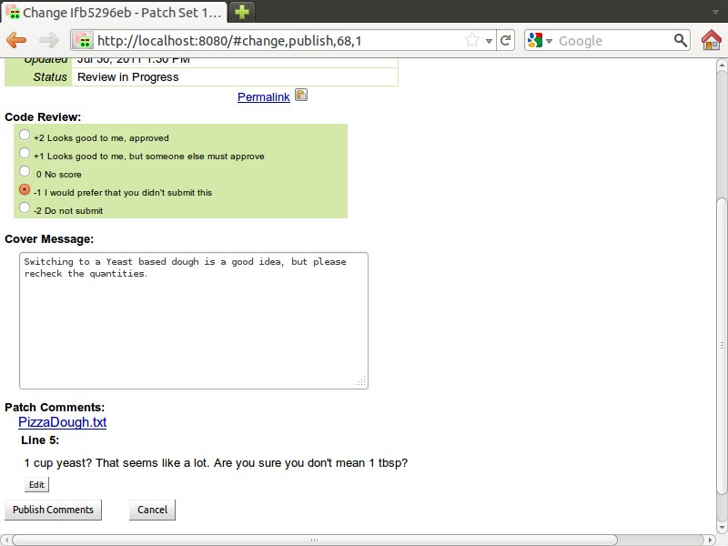

# Gerrit Code Review —— 快速介绍

> 版本：V2.13

[TOC]

Gerrit 是建立在 Git 版本控制系统之上的网页代码审查工具。不过既然你已经在看本指南了，那你大概已经知道这个信息了。本文可以让你回答这些问题：Gerrit 适合我吗？它可以适应我的工作流程和我的组织吗？

## 什么是 Gerrit？

既然你在读这篇文章了，我想你已经大致知道了代码审查的好处，只不过是想找一个技术支持方案来方便地进行代码审查。

对于不同的人来说，代码审查有着不同的意义。对有些人来说，代码审查就像有投影仪的会议，然后整个团队一行一行地浏览代码。对其他人而言则是让一些人在提交前能浏览一下代码。‌

Gerrit旨在提供一个轻量级框架，用于在每个提交被接受到代码库之前能接受审查。变更会上传到 Gerrit，但在其被审查并接受之前，实际上不会成为项目的一部分。在许多方面，这只是个简单的工具，以支持提交补丁的标准开源过程，然后在应用于代码库之前由项目成员审查。 然而，Gerrit 更进一步，使项目中的所有提交者都能够轻松确保在变更被实际应用之前得到检查。 因此，在所有用户都是可信赖提交者的情况下 Gerrit 同样有用，例如可能是闭源商业开发的情况。 无论哪种方式我们都需要检查代码以提高代码的质量和可维护性。 毕竟，如果只有一个人看过这个代码，当那个人离开时可能有点难以维护。‌

Gerrit 首先是一个临时区域，变更在成为代码库的一部分之前可以在这里接受检查。它也是这一审查过程的推动者，捕捉关于变更的注释和意见，以便能够讨论变更。这对于不能面对面进行对话的分布式团队尤其有用。即使是同处一地的团队，也可以选择一个评审工具，因为评审可以在评审者方便的时间进行。这使得开发人员能够在他们头脑还很清醒的时候创建评审并解释变更。如果没有这样的工具，他们要么需要打断某人来查看代码，要么在已经进入下一个任务的情况下切换上下文再来做解释。‌

同时这也创造了对话的持久化记录，这对于回答不可避免的“我知道我们因哪种原因做了变更”是很有用的。

## Gerrit 适合什么地方？

任何超过一个人的团队都（应该）有一个中心化的源码仓库。从理论上讲，Git 可以在没有这样一个中心化仓库的情况下工作，但在实践中总是会有这么一个中心化仓库。它提供了项目实际内容的权威副本。它是每个人抓取（Fetch）代码、推送（Push）代码以及持续集成构建服务器（CI Build Server）或类似工具获取源码的地方。


Gerrit 部署在这个中心化源码仓库的位置，并且增加了一个概念：等待变更（Pending Changes）的仓库。人们仍然从权威仓库（Authoritative Repository）中抓取，但不是推回权威仓库，而是推送到这个等待变更的地方。变更只有在被审查（Review）并通过（Approve）后才能提交（Submit）到权威仓库，成为被项目接受的一部分。


和其他仓库托管解决方案一样，Gerrit 有一套强大的[访问控制模型](./access-model.md)。用户甚至可以授权完全忽略代码审查，直接推送到中心仓库中。Gerrit 甚至可以不用代码审查，只用于托管仓库和控制访问权限。不过一般来说，就算用户可以直接推送，走一遍审查流程还是要更简单、更安全的。

## 变更的生命周期

了解 Gerrit 工作方式的最佳途径是跟随一个变更的整个生命周期。下面的例子中，我们的 Gerrit 服务器运行在一个叫做 gerrithost 的主机上，监听 HTTP 端口 8080、SSH 端口 29418。我们工作的项目名叫 RecipeBook，我们将在 master 分支上开发一个变更。

### 克隆仓库

很显然，我们要做的第一件事情是获取我们将要做修改的源代码。就和所有 git 项目一样，你通过克隆的方式从 Gerrit 托管的仓库中拉取代码：

```console
$ git clone ssh://gerrithost:29418/RecipeBook.git RecipeBook
Cloning into RecipeBook...
```

然后我们需要做修改变更，然后在本地 commit 变更。这一步 Gerrit 没有改变什么，就是个标准的编辑和 Git 操作。虽然没做强制要求，但是在 commit 信息中你最好添加一个 Change-Id，这样 Gerrit 可以将同一个变更的不同版本链接在一起。Gerrit 有一个标准的 [Change-ID commit-msg hook](./user-change-id.md) 用于在你 commit 时生成一个唯一的 Change-Id。如果你不这么做，那么 Gerrit 会在你推送变更时生成一个 Change-Id。但因为你的 commit 信息中没有 Change-Id，所以如果需要上传变更的另一个版本，你就得手动复制这个 Change-Id 进去。因为这个原因，你最好安装这个 hook，然后就可以忘了这事儿了。

### 创建审查

当你创建变更并在本地 commit 之后，就该推送变更到 Gerrit 以供审查了。这是通过 git push 到 Gerrit 服务器来做到的。因为我们直接从 Gerrit 克隆到了本地仓库，所以远程仓库就是 origin，不需要重新定义。

```console
$ <work>
$ git commit
[master 9651f22] Change to a proper, yeast based pizza dough.
 1 files changed, 3 insertions(+), 2 deletions(-)
$ git push origin HEAD:refs/for/master
Counting objects: 5, done.
Delta compression using up to 8 threads.
Compressing objects: 100% (2/2), done.
Writing objects: 100% (3/3), 542 bytes, done.
Total 3 (delta 0), reused 0 (delta 0)
remote:
remote: New Changes:
remote:   http://gerrithost:8080/68
remote:
To ssh://gerrithost:29418/RecipeBook.git
 * [new branch]      HEAD -> refs/for/master
```

唯一不同的地方是 `refs/for/master` 分支。这是个“魔法分支”，用来创建针对主分支的审查。对于每一个 Gerrit 跟踪的分支，都有一个对应的魔法分支 `refs/for/<branch_name>`让你推送来创建审查。

在命令的输出中你会发现一个指向我们刚刚推送到的 Gerrit 服务器上的 HTTP 地址。这就是我们审查这个 commit 的页面。让我们打开链接看看长啥样：


这是 Gerrit Code Review 审查变更的页面。你可以查看变更的差异，添加一些评论来解释你做了什么及为什么这么做，你也可以添加应该审查这个变更的用户。

审查人可以用各种方式找到他们想审查的变更。Gerrit 有一个强大的查询工具来允许项目负责人（或其他任何人）找到需要审查的变更。用户也可以用查询表达式监控 Gerrit 项目，这样 Gerrit 就会在匹配变更的时候提醒他们。所以创建审查的时候添加审查人只是个推荐。

这个时候，变更已经可以审查了，我们需要切换角色来继续跟随这个变更。现在假设我们是审查者。

### 审查变更

审查方的生命周期始于上面的 Gerrit Code Review 页面。他可以通过多种途径打开这个页面，然后因为某些原因他需要审查变更。需要特别注意的是页面中的两个 “Need” 行：

```
* Need Verified
* Need Code-Review
```

Gerrit 默认的工作流程要求变更在被接受前进行两次验证。代码审查（Code-Review）指的是让某人检查代码，保证其符合项目的基线、目标等等。验证（Verification）是验证代码可以编译、通过单元测试等等。验证一般是通过一个自动化构建服务器而不是人来做。甚至有一个 [Gerrit Trigger Jenkins Plugin](https://wiki.jenkins-ci.org/display/JENKINS/Gerrit+Trigger) 插件可以自动化构建每一个上传的变更，并更新 verified 分数。

在 Gerrit 中很重要的一点是，代码审查和验证是两个不同的权限，这让两个任务得以分开。比如说，一个自动化程序可以验证但不能审查代码。

既然我们是代码审查者，我们接下来就要审查代码。我们可以在 Gerrit 网页中使用联合视图或左右两页视图的比较工具来查看代码。在下面的例子中我们用了左右两页的视图。在任何一种视图中，你都可以通过双击代码行（或单击行号）来添加行内评论。你也可以通过在表头的任何地方（除了“Patch Sets“）双击或在行号列头的图标上单击来添加文件评论。一旦发布，这些评论就对全员可见，允许对变更进行讨论。


代码审查者最终花费大量时间浏览这些页面，查看并评论这些更改。为了让这项工作尽量高效，Gerrit 为绝大多数操作都提供了键盘快捷键（有些操作甚至只能通过热键触发）。任何时候你都可以敲下 `?` 键来查看键盘快捷键。


在看完变更后，我们需要完成审查提交。在我们开始的变更页面单击 *Review* 按钮，然后就可以输入 Code Review 标签和概述信息了。



审查者选择的标签会决定下一步会发生什么。+1 和 -1 级别只是一个观点，而 +2 和 -2 级别可以允许或禁止一个变更。要让一个变更被接受，必须至少有一个 +2，而且没有 -2 的投票。虽然这些值都是数字，但是不能累加。两个 +1 不等同于一个 +2。

无论选择了哪个标签，一旦点击了 *Publish Comments* 按钮，概述信息和所有评论都将对所有人可见。

在上面的例子中，变更没被接受，所以创建者需要返工。让我们切回创建者的角色。

### 重新修改变更

只要在我们上传变更前配置了 Change-Id commit-msg hook，重新修改是件很简单的事情。上传一个重新修改过的变更所需做的所有事情就是再推送一个 commit 信息中有着相同 Change-Id 的另一个 commit。因为 hook 在我们初始 commit 中添加了一个 Change-Id，我们只需要 checkout 然后 amend 这个 commit。然后就和创建审查一样推送到 Gerrit 中：

```console
$ <checkout first commit>
$ <rework>
$ git commit --amend
$ git push origin HEAD:refs/for/master
Counting objects: 5, done.
Delta compression using up to 8 threads.
Compressing objects: 100% (2/2), done.
Writing objects: 100% (3/3), 546 bytes, done.
Total 3 (delta 0), reused 0 (delta 0)
remote: Processing changes: updated: 1, done
remote:
remote: Updated Changes:
remote:   http://gerrithost:8080/68
remote:
To ssh://gerrithost:29418/RecipeBook.git
 * [new branch]      HEAD -> refs/for/master
```

注意这一回输出略有不同。因为我们正在添加到一个已有的审查，Gerrit 告诉我们变更升级了（updated）。

上传重新修改的 commit 后，我们可以回到 Gerrit 网页来看下我们的变更。


仔细看的话你会注意到有两个与此变更相关联的补丁（Patch）：初次提交的和再次提交的。为了不再重复上面的操作，我们假定这次可以让代码审核者给 +2 的评分。

### 测试变更

Gerrit 默认的工作流程中有两个审核的步骤，代码审查和验证。验证的意思是测验变更真的可以工作。这一般指的是验证代码编译，单元测试等。实际上，一个项目可以决定他们想要在这里做多少工作。同样值得注意的是，这只是 Gerrit 默认的工作流程，验证测试其实可以去掉，也可以添加其他步骤。

正如在代码审查一节所述，验证一般通过像 Gerrit Trigger Jenkins Plugin 这样的插件来实现自动化。但也有些时候代码需要人工验证，或审查者需要验证一些功能是否可用或如何运行。有时候在开发环境而不是网页上工作也挺好的。所有这些需求都涉及让人在他们开发环境获取变更。Gerrit 通过将每一个变更作为一个 git 分支来让这个过程变得简单。审查者所需做的就是从 Gerrit 服务器 fetch 并 checkout 这个分支，从而得到变更。

我们甚至不需要这么努力地去想这个问题，如果你仔细看 Gerrit Code Review 的截图，你会发现一个 *download* 命令。我们所需做的就是复制粘贴这个命令，然后运行。

```console
$ git fetch http://gerrithost:8080/p/RecipeBook refs/changes/68/68/2
From http://gerrithost:8080/p/RecipeBook
 * branch            refs/changes/68/68/2 -> FETCH_HEAD
$ git checkout FETCH_HEAD
Note: checking out 'FETCH_HEAD'.

You are in 'detached HEAD' state. You can look around, make experimental
changes and commit them, and you can discard any commits you make in this
state without impacting any branches by performing another checkout.

If you want to create a new branch to retain commits you create, you may
do so (now or later) by using -b with the checkout command again. Example:

  git checkout -b new_branch_name

HEAD is now at d5dacdb... Change to a proper, yeast based pizza dough.
```

​	

就是那么简单，我们现在已经可以在我们的工作拷贝中和这个变更玩耍了。你可能会对引用路径的数字感兴趣。

- 第一个 **68** 是变更 ID 除以 100 的余数。这个数字的唯一作用是降低 git 仓库中任一目录的文件数量。
- 第二个 **68** 是完整的变更 ID。你可以在 Gerrit 审查页面的 URL 中注意到这个值。
- **2** 是变更的补丁集编号。在这个例子中我们上传了一些修复，所以我们想要的是第二个补丁集，而不是第一个被拒绝的补丁集。

### 手动验证变更

为简化操作，我们来手动验证变更。验证人员可以是代码审查人员，或者是其他任何人。这实际上取决于项目的规模和有效性。如果你有 Verify 权限，那么当你在 Gerrit 网页上点击 *Review* 按钮的时候你可以看到 verify 分数。


不像代码审查那样，验证没有 +2 和 -2 级别，因为验证要么是成功要么是失败，所以我们只需要提交 +1（或 -1）。

### 提交变更

你可能已经注意到在验证的截图中有两个提交的按钮 *Publish Comments* 和 *Publish and Submit*。*Publish and Submit* 按钮总是可见，但只会在变更符合提交的标准时才有效（比如经过了验证和审查）。所以通过点击一个按钮来提交审查分和提交变更是很方便的。如果你选择 *Publish Comments* 那么分数会被保存，但是变更不会被接受进入代码库。这时候在主页面会有一个 *Submit Patch Set X* 的按钮。正如代码审查和验证是可以被不同用户做的不同操作，提交是第三种可以被限制到另一组用户的操作。

点击 *Publish and Submit* 或 *Submit Patch Set X* 按钮将合并变更到仓库的主要部分，这样变更将被接受成为项目的一部分。这之后任何人拉取 Git 仓库都会得到这个成为 master 分支一部分的变更。